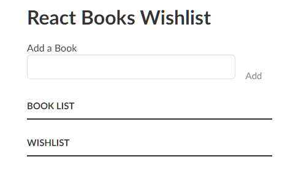

# Created with nextjs framework and tailwind

## Start project 

In the project directory, in a new terminal

### `npm i`

Install the dependencies for project

### `npm run dev`

Runs the app in the development mode.\
Open [localhost:300](localhost:300) to view it in your browser.

You'll see a form with an inputbox and two buttons, you can add books with the inputbox and see both lists(All books, Wishlisted books).
To add a book to the wishlist you'll need to click on the checkbox
